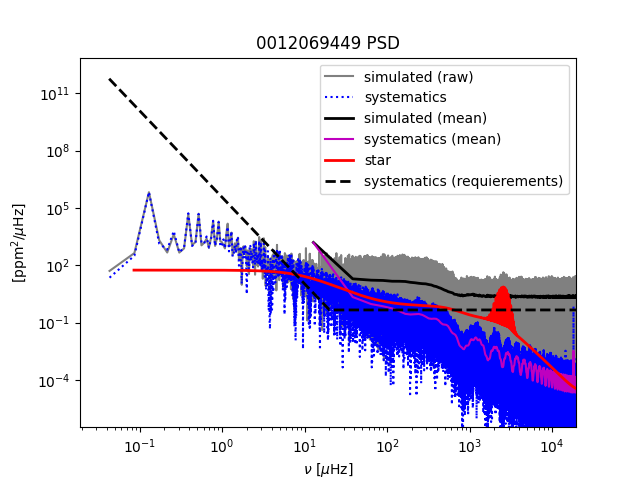
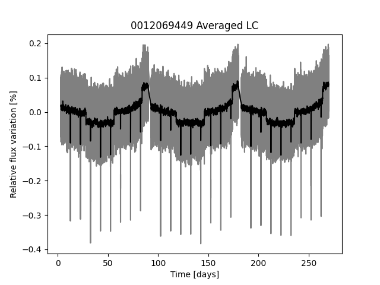

# Detecting Exoplanet Transits and Stellar Flares in PLATO Light Curves


## Page 1 of 4: Project Summary

This repository contains a Computational Astrobiology project on simulated PLATO light curves. The main goal is to build a reproducible workflow that generates stellar photometry, injects astrophysical events, and trains classifiers to recognize whether a light curve contains no event, stellar flares, exoplanet transits, or both.

For a non-specialist: a light curve is a record of how bright a star appears over time. A planet crossing in front of the star causes a small, repeating dip in brightness. A stellar flare causes a short, sharp brightening. Real telescope data also contain noise, gaps, and instrument drift, so the same signal can look different depending on observing conditions. This project creates controlled examples of those situations and tests whether machine-learning methods can learn the difference.

The project uses the PLATO Stellar Light-curve Simulator (PSLS) in `PlatoLightCurves/psls-1.9/` to produce physically motivated stellar signals. The generated dataset is stored in `PlatoLightCurves/Scripts/outputs/`, with labels in `PlatoLightCurves/Scripts/paired_simulation_labels_combined.csv`. The label table contains 2,000 simulations: 500 quiet systems, 500 flare-only systems, 500 transit-only systems, and 500 systems containing both a flare and a transit. The second half of the table adds instrument-drift categories so the models can be tested against a harder observing problem.

## Statement of Need

The scientific need is classification under realistic observational uncertainty. Transit detection is a central technique for discovering exoplanets, but light curves are not clean textbook signals. They contain stellar variability, stochastic oscillations, granulation, camera noise, spacecraft systematics, and missing data. A classifier trained only on idealized curves may perform well in a notebook but fail when drift or stellar activity changes the shape of the signal.

This project addresses that need by building a small but complete simulation-to-classification pipeline. It connects physical simulation, controlled labels, preprocessing, feature extraction, and machine learning. The work relates to existing methods in three ways:

- PSLS supplies the physics-based simulation layer for PLATO-like photometry.
- Box Least Squares and summary statistics provide interpretable baseline features for transit-like periodic dips and flare-like outliers.
- Random forests, convolutional neural networks, and transformer-style sequence models provide progressively more flexible classification approaches.

The result is not a production planet-search pipeline. It is a tutorial-scale experiment that demonstrates how astrobiology software can move from a physical question to simulated data, reproducible labels, and testable classifiers.

## Main Files

- `PlatoLightCurves/Scripts/data_generation.ipynb`: creates simulation labels and PSLS configuration files.
- `PlatoLightCurves/Scripts/run_simulations.py`: batch-runs PSLS configurations into output light-curve folders.
- `PlatoLightCurves/Scripts/preprocessing.ipynb`: explores correction of mask updates, gaps, and drift.
- `PlatoLightCurves/Scripts/random_forest.ipynb`: feature-based classifier and drift analysis.
- `PlatoLightCurves/Scripts/CNN.ipynb`: one-dimensional convolutional neural network classifier.
- `PlatoLightCurves/Scripts/transformers.ipynb`: transformer-style light-curve classifier.
- `PlatoLightCurves/Scripts/paired_simulation_labels_combined.csv`: final label table used by the classifiers.

<div style="page-break-after: always;"></div>

## Page 2 of 4: Data Generation and Scientific Process



The first stage is simulation. Instead of downloading a finished dataset, the project defines many synthetic stellar systems and runs them through PSLS. Each system has a master random seed, stellar parameters, and optional event settings. The key label fields are:

- `anomaly_class`: integer class target, where `0` is quiet, `1` is flare, `2` is transit, and `3` is flare plus transit.
- `label_has_flares`: binary flag for flare injection.
- `label_has_transit`: binary flag for transit injection.
- `star_mass`, `star_teff`, `star_logg`: physical stellar parameters.
- `flare_amplitude`: flare strength for flare-positive examples.
- `transit_period`, `transit_radius_earth`: injected planet parameters for transit-positive examples.
- `drift`: instrument drift category, including `none`, `low`, `medium`, `high`, and `max`.

The simulator writes `.dat` files such as `PlatoLightCurves/Scripts/outputs/sys_0000/0012069449.dat`. Each file stores time, relative flux, and a status or mask column. The flux column is the main learning signal. The time column is needed for plotting, interpolation, and period-search features.


The dataset is deliberately balanced by event class. This makes the first classification problem easier to interpret because overall accuracy is not dominated by the most common class. The drift categories are not perfectly balanced because they represent a second stress-test dimension rather than the primary target. This is useful for the presentation because the model can be evaluated both by event class and by drift strength.

## Physical Meaning of the Labels

Quiet systems are the control group. They still include stellar and instrumental variability, but they do not contain the injected flare or transit events. Flare systems test whether a model can recognize short-duration positive spikes above the stellar background. Transit systems test whether the model can recognize repeated negative dips caused by a planet crossing the stellar disk. Flare-plus-transit systems test whether the model can identify mixed astrophysical behavior instead of assuming only one event type is present.

Instrument drift is important because it can imitate or hide astrophysical signals. A slow trend can reduce the apparent depth of a transit or change the local baseline around a flare. Adding drift therefore turns the task from a clean pattern-recognition exercise into a closer approximation of real observational work.

## Preprocessing

The preprocessing notebooks focus on turning raw simulator output into arrays that a model can learn from. The main operations are:

- Load each `.dat` file from its system folder.
- Remove or correct discontinuities from mask updates and gaps.
- Normalize the flux so stars with different baseline brightness can be compared.
- Resample or truncate long curves to a fixed length when needed by neural networks.
- Keep labels joined to the processed curve by `system_id`.

This stage is scientifically important because many false positives and false negatives come from preprocessing choices. Over-smoothing can erase shallow transits or narrow flares. Under-correcting drift can cause a model to learn instrument behavior instead of astrophysics.

<div style="page-break-after: always;"></div>

## Page 3 of 4: Models, Interpretation, and Course Concepts



The machine-learning part compares interpretable and sequence-based approaches. The random forest notebook is the best live-run candidate because it exposes the full logic clearly: load labels, read light curves, extract features, split train/test data, fit the model, and inspect classification results. The CNN and transformer notebooks are useful extensions for explaining how deep learning can operate directly on the time series.

## Random Forest Baseline

The random forest model builds a table of engineered features from each light curve. These features include statistical moments, outlier behavior, and period-search information. This approach is valuable because the features can be explained in physical language:

- Large positive excursions suggest flares.
- Repeating negative dips suggest transits.
- Skewness, kurtosis, and percentile spreads describe non-Gaussian light-curve shapes.
- Box Least Squares features connect the model to a standard transit-search method.

The random forest is also robust for a small educational dataset. It can handle mixed feature scales through an imputation pipeline, gives feature-importance diagnostics, and usually trains quickly enough for a live presentation.

## CNN Classifier

The CNN treats the light curve as a one-dimensional signal. Convolution filters slide across time and learn local shapes such as flare spikes, transit ingress and egress, or short clusters of noisy points. Pooling layers reduce the sequence length while keeping important patterns. This is a natural architecture for light curves because the timing of a pattern may shift from one system to another, but the local event shape still matters.

The main tradeoff is interpretability. The CNN can learn directly from the data without hand-designed features, but it is harder to explain exactly which physical measurement drove a prediction. For the exam presentation, the CNN is a good example of an innovation step after the random forest baseline.

## Transformer Classifier

The transformer notebook explores a more flexible sequence model. Attention can compare distant regions of the same light curve, which is useful when transit evidence appears as repeated dips separated by many days. This model is more computationally demanding and needs careful regularization, but it connects the project to modern sequence-learning ideas.

## Course Concepts Used

This project uses several core ideas from the course:

- Simulation as a way to create labeled scientific data when real labels are scarce.
- Time-series analysis for periodic and transient events.
- Supervised learning with explicit train/test splits.
- Feature engineering versus representation learning.
- Model evaluation with confusion matrices, classification reports, and robustness checks.
- Reproducibility through fixed seeds, relative paths, saved labels, and documented dependencies.

The strongest coding practices in the repository are the separation between generation, preprocessing, and modeling notebooks; the use of CSV label tables as a clear interface between stages; and the use of deterministic seeds for repeatable simulations. The main improvement to make with more time would be to convert repeated notebook code into importable Python modules and add small unit tests for the loader, preprocessing, and feature-extraction functions.

<div style="page-break-after: always;"></div>

## Page 4 of 4: How to Run and Present

## Environment Setup

Create and activate a clean Python environment from the repository root:

```bash
python3 -m venv .venv
source .venv/bin/activate
python -m pip install --upgrade pip
python -m pip install -r requirements.txt
python -m pip install -e PlatoLightCurves/psls-1.9
```

The notebooks should be opened from the repository root or from `PlatoLightCurves/Scripts/` using relative paths only. Do not add local absolute paths such as `/content/...` or `C:/Users/...` before submission.


